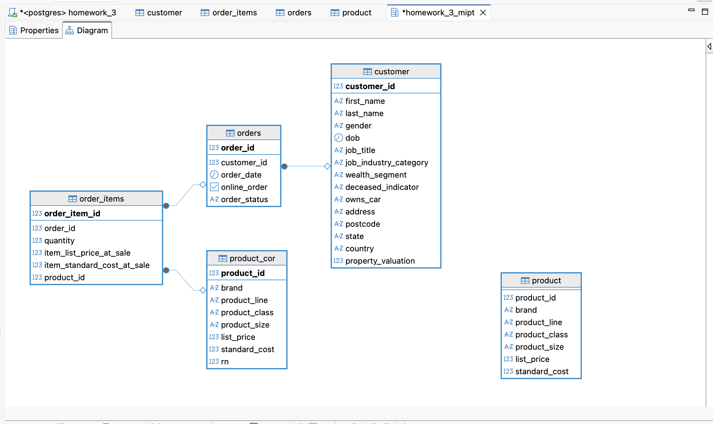
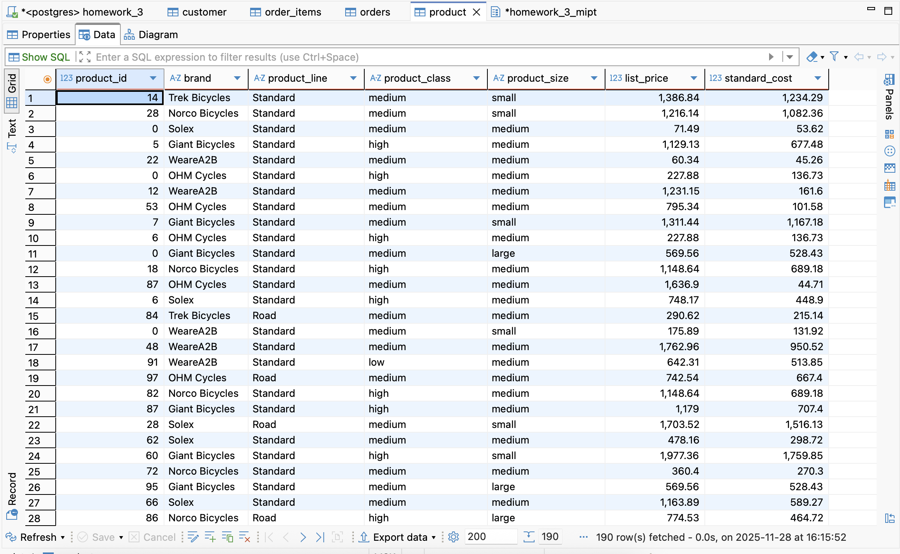
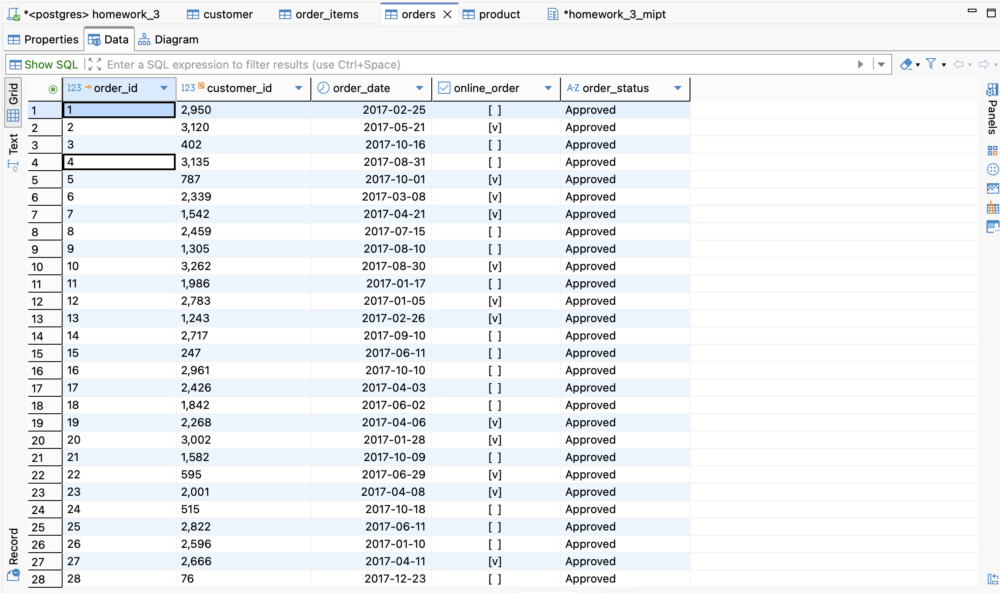
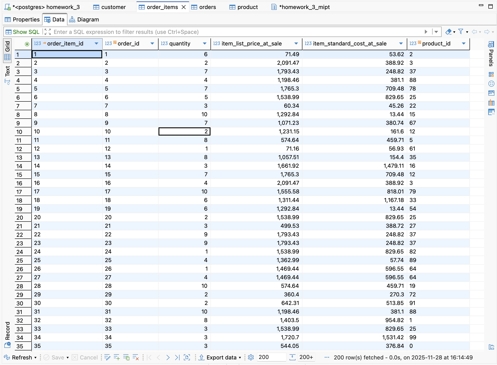

# Группировка данных и оконные функции

**Выполнила**: Смирнова Анастасия

<hr>
 
## 📁 Структура проекта

```text
creating_and_normalazing_db/
├── 📁 sql_sripts/              # SQL-скрипты
│   └── 📄 Смирнова_А.М.sql
├── 📄 README.md                # Документация

```

## Описание данных

 <hr>

<details>
 
<summary><b>Таблица 'customer' с полями:</b></summary>

- `сustomer_id` -	ID клиента;
- `first_name` - Имя клиента;
- `last_name` -	Фамилия клиента;
- `gender` -	Пол;
- `DOB` -	Дата рождения;
- `job_title` -	Профессия;
- `job_industry_category` -	Сфера деятельности;
- `wealth_segment` -	Сегмент благосостояния;
- `deceased_indicator` -	Индикатор актуального клиента;
- `owns_car` -	Индикатор наличия автомобиля;
- `address` -	Адрес проживания;
- `postcode` -	Почтовый индекс;
- `state` -	Штаты;
- `country` -	Страна проживания;
- `property_valuation`	Оценка имущества.

</details>

<details>
 
<summary><b>Таблица 'product' с полями:</b></summary>

- `product_id` -	ID продукта;
- `brand` -	Бренд;
- `product_line` -	Линейка продуктов;
- `product_class` -	Класс продукта;
- `product_size` -	Размер продукта;
- `list_price` -	Цена;
- `standard_cost` -	Стандартная стоимость.

</details>

<details>
 
<summary><b>Таблица 'orders' с полями:</b></summary>

- `order_id` -	ID транзакции;
- `customer_id` -	ID клиента;
- `order_date` -	Дата транзакции;
- `online_order` -	Индикатор онлайн-заказа;
- `order_status` -	Статус транзакции.

</details>

<details>
 
<summary><b>Таблица 'order_items' с полями:</b></summary>

- `order_item_id` -	ID позиции в заказе;
- `order_id` -	ID заказа;
- `product_id` -	ID продукта;
- `quantity` -	Количество данного продукта в заказе;
- `item_list_price_at_sale` - Цена продукта в момент продажи;
- `item_standard_cost_at_sale` -	Стандартная стоимость продукта в момент продажи.

</details>

## Загрузка данных и запросы

 <hr>

После загрузки данных в DBeaver БД имеет следующий вид:



<details>
<summary><b>Таблица 'customer':</b></summary>


</details>

<details>
 
<summary><b>Таблица 'product':</b></summary>



</details>

<details>
 
<summary><b>Таблица 'orders':</b></summary>



</details>

<details>
 
<summary><b>Таблица 'order_items':</b></summary>



</details>

Создание таблиц и запросы описаны в [SQL-скрипте](https://github.com/steishas/homework3mipt_postgressql/blob/main/%D0%A1%D0%BC%D0%B8%D1%80%D0%BD%D0%BE%D0%B2%D0%B0_%D0%90_%D0%9C.sql).

## Результаты запросов

 <hr>

<details>
<summary><b>Запрос 1:</b></summary>


</details>

<details>
<summary><b>Запрос 2:</b></summary>


</details>

<details>
<summary><b>Запрос 3:</b></summary>


</details>

<details>
<summary><b>Запрос 4:</b></summary>


</details>

<details>
<summary><b>Запрос 5:</b></summary>


</details>


<details>
<summary><b>Запрос 6:</b></summary>


</details>

<details>
<summary><b>Запрос 7:</b></summary>


</details>

<details>
<summary><b>Запрос 8:</b></summary>


</details>
